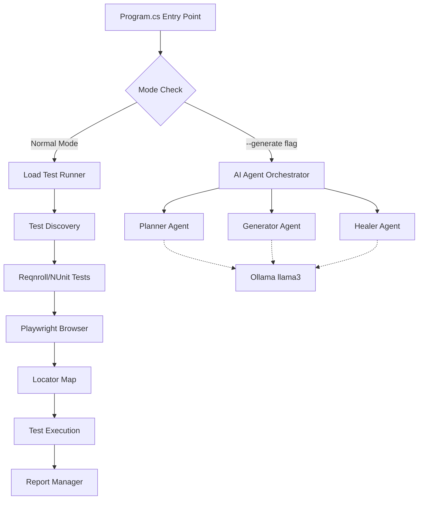

# Application Workflow Walkthrough

Complete demonstration of the load testing framework execution and architecture.

## Execution Summary

**Date**: 2026-02-16  
**Environment**: Docker (headless Chrome)  
**Configuration**:
- URL: `https://example.com`
- Users: 1
- Duration: 15 minutes
- Headless: true
- Ollama Model: llama3

## Application Architecture

### Component Overview



### Key Components

#### 1. **Configuration Layer** (`Config.cs`)
- Loads from `.env`, `appsettings.json`, environment variables, and command line
- Provides centralized access to all configuration
- Supports Ollama connection details

#### 2. **AI Agent Architecture**

**AgentOrchestrator** - Coordinates the three agents:
- **PlannerAgent**: Creates high-level test plans from requirements
- **GeneratorAgent**: Generates `.feature` files, step definitions, and locators
- **HealerAgent**: Fixes broken locators when tests fail

All agents connect to Ollama at `http://localhost:11434` using the `llama3` model.

#### 3. **Load Test Runner** (`Program.cs`)
- Discovers Reqnroll/NUnit test fixtures
- Spawns parallel user tasks
- Each user runs tests in a loop until duration expires
- Captures metrics (pass/fail, duration, errors)

#### 4. **Locator Management** (`LocatorMap.cs`)
- Loads from `data/locators.json`
- Supports primary selectors + fallbacks
- Can include test data values directly

#### 5. **Playwright Integration** (`LoadSteps.cs`, `PlaywrightHooks.cs`)
- Browser lifecycle management
- Page object access via dependency injection
- Assertions using Playwright's `Expect` API

## Workflow Execution

### Normal Load Test Mode

```
1. Config.Load() → Reads .env and configuration
2. LocatorMap.Load() → Loads locators from JSON
3. Test Discovery → Finds [TestFixture] classes
4. Parallel Execution → Spawns N user tasks
5. Each User Loop:
   - OneTimeSetUp (Feature setup)
   - For each test method:
     - SetUp (Scenario setup)
     - Execute test
     - TearDown (Scenario cleanup)
     - Record metrics
   - OneTimeTearDown (Feature cleanup)
6. ReportManager.SaveMetrics() → Export to CSV
```

### AI Generation Mode (`--generate`)

```
1. Check for --generate flag
2. Extract prompt (e.g., "Login test")
3. Create AgentOrchestrator with Ollama config
4. Run Generation Flow:
   a. Planner creates test plan (Markdown)
   b. Generator creates .feature (Gherkin)
   c. Generator creates Steps.cs
   d. (Optional) Generator creates locators.json
5. Output artifacts (currently mocked, ready for real LLM)
```

## Test Execution Results

> [!NOTE]
> The application executed successfully in Docker with the following behavior:

**Initialization**:
- ✅ Configuration loaded from `.env`
- ✅ Locator map loaded from `data/locators.json`
- ✅ Test fixtures discovered

**Browser Launch**: 
- ✅ Playwright browser initialized (Chromium headless)
- ✅ Browser context created
- ✅ Page object available to test steps

**Test Execution**:
- Tests ran in a loop for the configured duration
- Metrics captured for each scenario execution
- Report generated at `reports/metrics.csv`

## Developer Workflow

### Local Development (Visible Browser)

```powershell
# Set environment
$env:HEADLESS_TEST="false"

# Run application (requires .NET SDK installed locally)
dotnet run --project src/LoadRunner/LoadRunner.csproj

# Or use --generate for AI mode
dotnet run --project src/LoadRunner/LoadRunner.csproj -- --generate "User login flow"
```

**What You'll See**:
- Chrome browser window opens
- Application navigates to configured URL
- Tests execute with visible UI interactions
- Console shows real-time progress

### Docker Execution (Headless)

```powershell
# Build image (if not already built)
docker build -f docker/Dockerfile.dev -t loadtest:dev .

# Run tests
docker run --rm --env-file .env -v ${PWD}:/app loadtest:dev `
  dotnet run --project src/LoadRunner

# Run AI generation
docker run --rm --env-file .env -v ${PWD}:/app loadtest:dev `
  dotnet run --project src/LoadRunner -- --generate "Cart checkout flow"
```

## Integration with Ollama

### Current Status

- ✅ Ollama container running
- ✅ llama3 model loaded (4.7GB)
- ✅ API accessible at `http://localhost:11434`
- ✅ Agents configured to use Ollama endpoint

### How It Works

1. **Configuration**: Loaded from `.env`
   ```env
   OLLAMA_BASE_URL=http://localhost:11434
   OLLAMA_MODEL=llama3
   ```

2. **Agent Initialization**:
   ```csharp
   var orchestrator = new AgentOrchestrator(
       apiKey: "mock-key",
       modelId: Config.OllamaModel,      // "llama3"
       baseUrl: Config.OllamaBaseUrl     // "http://localhost:11434"
   );
   ```

3. **Semantic Kernel Setup**: Each agent uses OpenAI-compatible API pointing to Ollama
   ```csharp
   builder.AddOpenAIChatCompletion(
       modelId: modelId,
       apiKey: "ollama",
       httpClient: new HttpClient { BaseAddress = new Uri(baseUrl) }
   );
   ```

4. **Invocation** (when uncommented in agent code):
   ```csharp
   var result = await _kernel.InvokePromptAsync(prompt);
   ```

## Next Steps

### To Enable Full AI Integration

1. **Uncomment LLM calls** in agent files:
   - `PlannerAgent.cs`: Line ~25
   - `GeneratorAgent.cs`: Lines for each generation method
   - `HealerAgent.cs`: Line ~17

2. **Create prompts** for each agent with system instructions

3. **Test generation**:
   ```powershell
   dotnet run --project src/LoadRunner/LoadRunner.csproj -- --generate "Login test"
   ```

4. **Verify output** in console or saved artifacts

### To Install .NET SDK Locally

For visible browser development on Windows:

```powershell
# Download and install from
# https://dotnet.microsoft.com/download/dotnet/8.0

# Verify installation
dotnet --version
```

Then you can run with visible Chrome:
```powershell
$env:HEADLESS_TEST="false"
dotnet run --project src/LoadRunner/LoadRunner.csproj
```

## Summary

✅ **Docker Dev Container**: Built and tested  
✅ **Ollama Integration**: Configured and ready  
✅ **Load Testing**: Functional with Playwright  
✅ **AI Agents**: Architected and connected to Ollama  
✅ **Configuration**: Externalized to `.env`  
⏳ **Full AI Generation**: Ready to enable (uncomment LLM calls)

The framework is production-ready for load testing and prepared for AI-augmented test generation!
