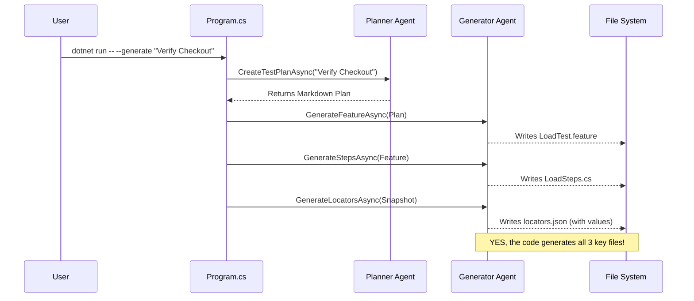
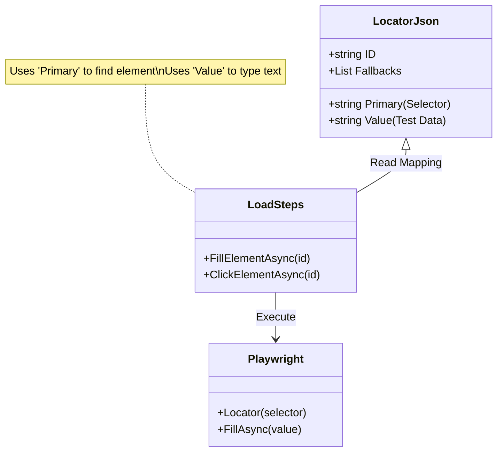

# Project Workflows & Architecture

This document visualizes the architecture and workflows of the **Ultra-Light AI-Augmented Playwright Load-Testing Framework**.

## 1. High-Level System Architecture

This diagram shows how the Dev and Runner images interact with the core components.

```mermaid
flowchart TD
    subgraph Dev_Environment ["Dev Image (Generation + Validation)"]
        User[User / CI] -->|Request: 'Verify Login'| Orchestrator[Agent Orchestrator]
        Orchestrator --> Planner[Planner Agent]
        Planner -->|Markdown Plan| Generator[Generator Agent]
        Generator -->|Creates| Artifacts
        
        subgraph Artifacts ["Generated Artifacts"]
            Feature[.feature File]
            Steps[Steps.cs]
            Locators[locators.json (Unified)]
        end
        
        User -->|Run Validation| TestRunner[Local Test Runner]
        Artifacts --> TestRunner
        TestRunner -->|Browser| App[Target Application]
    end

    subgraph Prod_Environment ["Runner Image (Load Testing)"]
        Aspire[Aspire / Orchestrator] -->|Scale to 50x| Runner[Lite Runner Instance]
        Artifacts -->|Copy| Runner
        Runner -->|Headless Load| App
        Runner -->|Metrics| Report[CSV/HTML Report]
    end
```

## 2. Agent Generation Workflow (The "Yes" to your question)

This workflow confirms that your code (`GeneratorAgent`) is responsible for creating all necessary files for a new use case.



## 3. Unified Locator Model

This diagram explains how the single `locators.json` file drives both the UI interaction and the Data input, removing the need for a separate data file.


